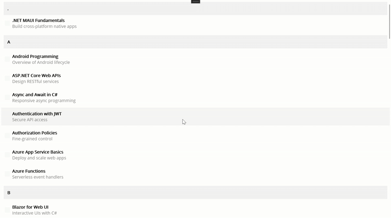
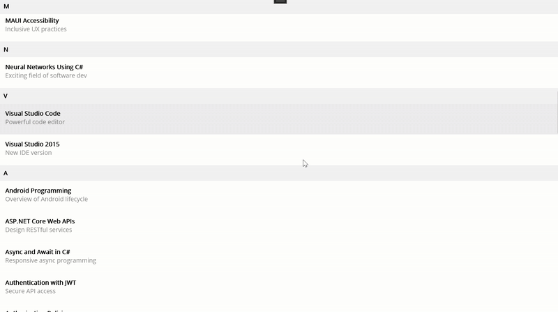

# How-Syncfusion-.NET-MAUI-List-View-Outshines-.NET-MAUI-Collection-View
This demo shows How Syncfusion .NET MAUI List View Outshines .NET MAUI Collection View

## Overview

Collection View is great until you need product level polish. Once you add grouping with sticky headers, swipe actions, item‑reordering, and smooth infinite scroll, boilerplate starts creeping in. Syncfusion® .NET MAUI List View packages those “extras” into focused properties, templates, and commands.

## Why Collection View needs extra work
* Sticky group headers not built in.
* Swipe: needs Swipe View around each item.
* Incremental loading: threshold event or manual logic.
* Reorder: requires custom drag/drop logic; no simple property.
* Performance tuning: more manual (measure, template complexity, virtualization concerns).

## What Syncfusion® .NET MAUI List View gives you out of the box 
1. Grouping with sticky headers (IsStickyGroupHeader): Pins the current group header at the top while scrolling.
2. Swipe actions (AllowSwiping + Start/EndSwipeTemplate): Reveals quick actions by swiping left or right on an item.
3. Drag-and-drop reorder (DragStartMode + ItemDragging): Lets users reorder items directly with a drag gesture.
4. Incremental loading (LoadMoreOption + LoadMoreCommand + IsLazyLoading): Loads the page on demand for faster, lighter lists.
5. Layout choices (LinearLayout, GridLayout): Switches between list and grid presentations to fit the content.
6. Item sizing and virtualization (ItemSize, QueryItemSize): Uses fixed or measured row heights to keep scrolling smooth.

## End-to-End Sample: Grouped Book List with Swipe and Load More
This end-to-end sample demonstrates a grouped, bindable book list built with MVVM, highlighting both .NET MAUI Collection View and Syncfusion® .NET MAUI List View. It covers sticky headers, swipe actions, item reorder, and incremental loading, with minimal boilerplate. 

Use it as a practical reference to choose between Collection View and Syncfusion® .NET MAUI List View based on your feature and performance needs.

# Model :

Define a lightweight MVVM-ready data model (BookInfo) implementing INotifyPropertyChanged for BookName, BookDescription, and IsFavorite with minimal, performant setters.
Add a collection type (BookGroup : ObservableCollection) to organize books into groups for grouped UI/list views.

```
public class BookInfo : INotifyPropertyChanged
{
    private string bookName, bookDesc;
    private bool isFavorite;

    public string BookName
    {
        get => bookName;
        set { if (bookName == value) return; bookName = value; OnPropertyChanged(); }
    }

    public string BookDescription
    {
        get => bookDesc;
        set { if (bookDesc == value) return; bookDesc = value; OnPropertyChanged(); }
    }

    public bool IsFavorite
    {
        get => isFavorite;
        set { if (isFavorite == value) return; isFavorite = value; OnPropertyChanged(); }
    }

    public event PropertyChangedEventHandler PropertyChanged;
    private void OnPropertyChanged([CallerMemberName] string name = null) =>
        PropertyChanged?.Invoke(this, new PropertyChangedEventArgs(name));
}
public class BookGroup : ObservableCollection<BookInfo>
{
    public string Name { get; }
    public BookGroup(string name, IEnumerable<BookInfo> items) : base(items) => Name = name;
}
```

# ViewModel:
Create a model repository in ViewModel.cs exposing an ObservableCollection preinitialized with the required number of items for immediate data binding.
Uses a compact, bindable BookInfo model (Name, Description, Favorite) implementing INotifyPropertyChanged for XAML-friendly MVVM.

```
public class BookInfoRepository : INotifyPropertyChanged
{
    // Create ObservableCollections as BookInfo and BookGroups
    // Create required commands 

    public BookInfoRepository()
    {
        // Wiring the commands here
        LoadInitialBooks();
    }

    private void LoadInitialBooks()
    {
        // Add initial items to display in the view
    }

    // Add code for performing LoadMore

    private void AddBooks(int start, int count)
    {
        var books = new[]
        {
            // Add Book data here
         };

        // Add books into the BookInfo Collection
    }
    // Adding the Grouped Collections into the BookGroups for Collection View
}
```
Note: For complete definitions, refer to the GitHub sample.

# XAML :
# For Collection View

Use a grouped CollectionView bound to BookGroups with Multiple selection. Add GroupHeaderTemplate for section headers and an ItemTemplate that wraps each item in a Swipe View to expose actions.

```
<CollectionView x:Name="List"
                ItemsSource="{Binding BookGroups}"
                IsGrouped="True"
                SelectionMode="Multiple">

    // Add Group header template for the headers
    // Add ItemTemplate with Swipe View and with LeftItems and RightItems template

</CollectionView>
```

Output:



# For ListView

Use Syncfusion® .NET MAUI List View with Multiple selection, sticky group headers, swipe actions, drag-and-drop, and manual “Load more”. Bind ItemsSource and LoadMoreCommand from your ViewModel.
Note:  Install the necessary package to use the control in the application.

```
<sfListView:SfListView  x:Name="listView"
                        ItemsSource="{Binding BookInfo}"
                        SelectionMode="Multiple"
                        IsStickyGroupHeader="True"
                        AllowSwiping="True"
                        ItemSize="70"
                        DragStartMode="OnHold"
                        LoadMoreOption="Manual"
                        LoadMorePosition="End"
                        LoadMoreCommand="{Binding LoadMoreItemsCommand}"
                        LoadMoreCommandParameter="{Binding Source={x:Reference listView}}">

// Add Group header template with binding key to it.
// Add ItemTemplate for how you want to display the items
// Add StartSwipeTemplate and EndSwipeTemplate for the Swiping actions

</sfListView:SfListView>
```

Output:
 


## Troubleshooting
Path too long exception
If you are facing a path too long exception when building this example project, close Visual Studio and rename the repository to a shorter name before building the project.

For a step-by-step procedure, refer to the [AI-Powered Billionaire Wealth Dashboard Blog](https://www.syncfusion.com/blogs/post/ai-powered-winui-line-chart).