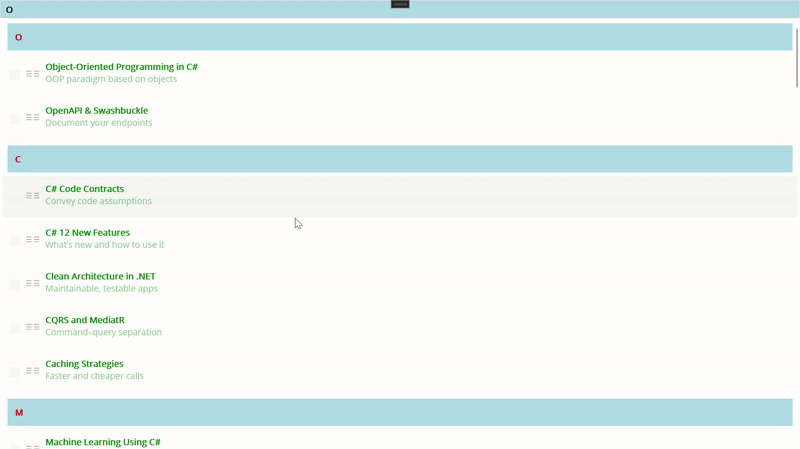
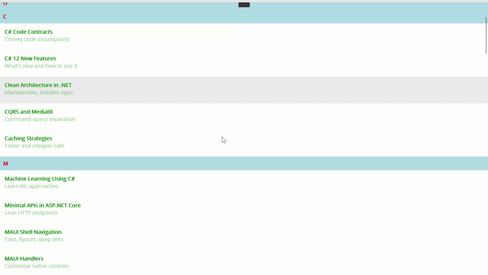

# How-Syncfusion-.NET-MAUI-List-View-Outshines-.NET-MAUI-Collection-View

.NET MAUI Collection View is great until you need real polish. When you add grouping with sticky headers, swipe actions, drag to reorder, and smooth infinite scroll, extra code starts piling up.

Syncfusion® .NET MAUI List View makes these features simple with clear properties, flexible templates, and MVVM-friendly commands. It includes fast virtualization for large data, reliable incremental loading and empty states, and consistent behavior across all platforms. 

If .NET MAUI Collection View gets you started, Syncfusion® .NET MAUI List View helps you ship faster with less glue code and better performance.

## What Syncfusion® .NET MAUI List View gives you out of the box 
1. Grouping with sticky headers (IsStickyGroupHeader): Pins the current group header at the top while scrolling.
2. Swipe actions (AllowSwiping + Start/EndSwipeTemplate): Reveals quick actions by swiping left or right on an item.
3. Drag-and-drop reorder (DragStartMode + ItemDragging): Lets users reorder items directly with a drag gesture.
4. Incremental loading (LoadMoreOption + LoadMoreCommand + IsLazyLoading): Loads the page on demand for faster, lighter lists.
5. Layout choices (LinearLayout, GridLayout): Switches between list and grid presentations to fit the content.
6. Item sizing and virtualization (ItemSize, QueryItemSize): Uses fixed or measured row heights to keep scrolling smooth.

## Syncfusion® .NET MAUI List View vs .NET MAUI Collection View

This section puts .NET MAUI Collection View and Syncfusion® .NET MAUI List View side by side, using the same MVVM book list. You will see how each control manages real needs like sticky group headers, swipe actions, drag‑to‑reorder, and incremental loading.

The goal is not theory; it is practical code you can copy. Notice where ListView uses built‑in properties and templates, and where Collection View needs extra event wiring and state. By the end, you will know which option fits your feature set, performance targets, and maintenance budget.

### .NET MAUI Collection View

### Syncfusion® .NET MAUI ListView

### Memory usage comparison
* This section presents a side-by-side memory usage comparison between Syncfusion® .NET MAUI List View and .NET MAUI Collection View using Visual Studio Diagnostics.
* With fifty identical items and templates, it reports peak process memory, allocation churn, and managed heap growth.
Profiler metric	Syncfusion® .NET MAUI List View	.NET MAUI Collection View

### Usage Summary
* Peak memory: Syncfusion List View uses ~34 MB less (~28% reduction). 
* Allocation churn: Syncfusion List View allocates ~98% fewer objects (23,761 vs 1,139,714). 
* Managed heap growth while scrolling: Syncfusion List View is ~77% lower (1,613 KB vs 7,005 KB). 
* Warm-up retained heap: Similar for both (~2.2 MB).

Syncfusion® .NET MAUI List View is significantly better in memory efficiency, especially in allocation churn and heap growth.

`Note`: Values are approximate and may vary by environment. These values are recorded on Windows 11 Enterprise 24H2 (build 26100.7462), .NET 10 SDK (10.0.100), .NET MAUI 10.0.1, Visual Studio 2026; hardware: AMD Ryzen 5 7530U, 16 GB RAM.

## Troubleshooting
### Path too long exception
If you are facing a path too long exception when building this example project, close Visual Studio and rename the repository to a shorter name before building the project.

For a step-by-step procedure, refer to the AI-Powered Billionaire Wealth Dashboard Blog.