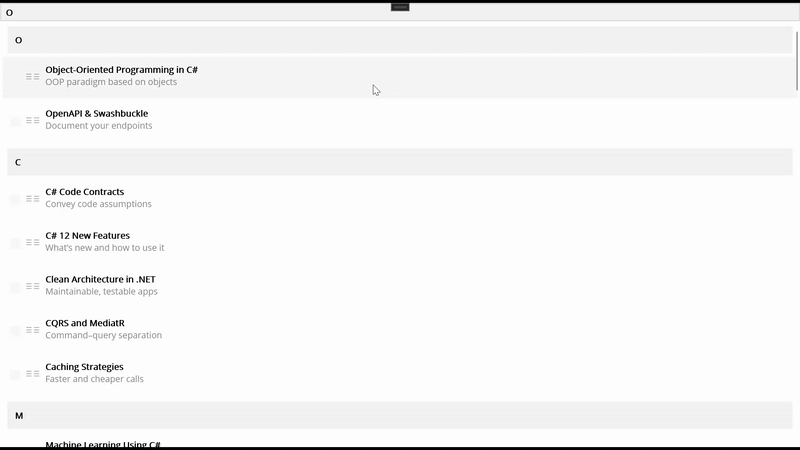
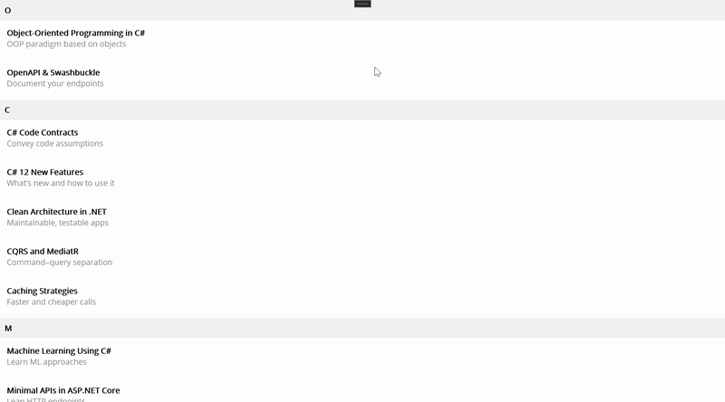

# How-Syncfusion-.NET-MAUI-List-View-Outshines-.NET-MAUI-Collection-View

## Overview

.NET MAUI Collection View is great until you need real polish. When you add grouping with sticky headers, swipe actions, drag to reorder, and smooth infinite scroll, extra code starts piling up.

Syncfusion® .NET MAUI List View makes these features simple with clear properties, flexible templates, and MVVM-friendly commands. It includes fast virtualization for large data, reliable incremental loading and empty states, and consistent behavior across all platforms. 

If .NET MAUI Collection View gets you started, Syncfusion® .NET MAUI List View helps you ship faster with less glue code and better performance.

## What Syncfusion® .NET MAUI List View gives you out of the box 
1. Grouping with sticky headers (IsStickyGroupHeader): Pins the current group header at the top while scrolling.
2. Swipe actions (AllowSwiping + Start/EndSwipeTemplate): Reveals quick actions by swiping left or right on an item.
3. Drag-and-drop reorder (DragStartMode + ItemDragging): Lets users reorder items directly with a drag gesture.
4. Incremental loading (LoadMoreOption + LoadMoreCommand + IsLazyLoading): Loads the page on demand for faster, lighter lists.
5. Layout choices (LinearLayout, GridLayout): Switches between list and grid presentations to fit the content.
6. Item sizing and virtualization (ItemSize, QueryItemSize): Uses fixed or measured row heights to keep scrolling smooth.

## Comparison Sample: Syncfusion® .NET MAUI List View and  .NET MAUI Collection View

This sample demonstrates a grouped, bindable book list built with MVVM, highlighting both .NET MAUI Collection View and Syncfusion® .NET MAUI List View. It covers sticky headers, swipe actions, item reorder, and incremental loading, with minimal boilerplate.

Use it as a practical reference to choose between Collection View and Syncfusion® .NET MAUI List View based on your feature and performance needs.

### Collection View

Use a grouped CollectionView bound to BookGroups with Multiple selection. Add GroupHeaderTemplate for section headers and an ItemTemplate that wraps each item in a Swipe View to expose actions.

### ListView

Use Syncfusion® .NET MAUI List View with Multiple selection, sticky group headers, swipe actions, drag-and-drop, and manual “Load more”. Bind ItemsSource and LoadMoreCommand from your ViewModel.
Note:  Install the necessary package to use the control in the application.

## Troubleshooting
Path too long exception
If you are facing a path too long exception when building this example project, close Visual Studio and rename the repository to a shorter name before building the project.

For a step-by-step procedure, refer to the [AI-Powered Billionaire Wealth Dashboard Blog](https://www.syncfusion.com/blogs/post/ai-powered-winui-line-chart).